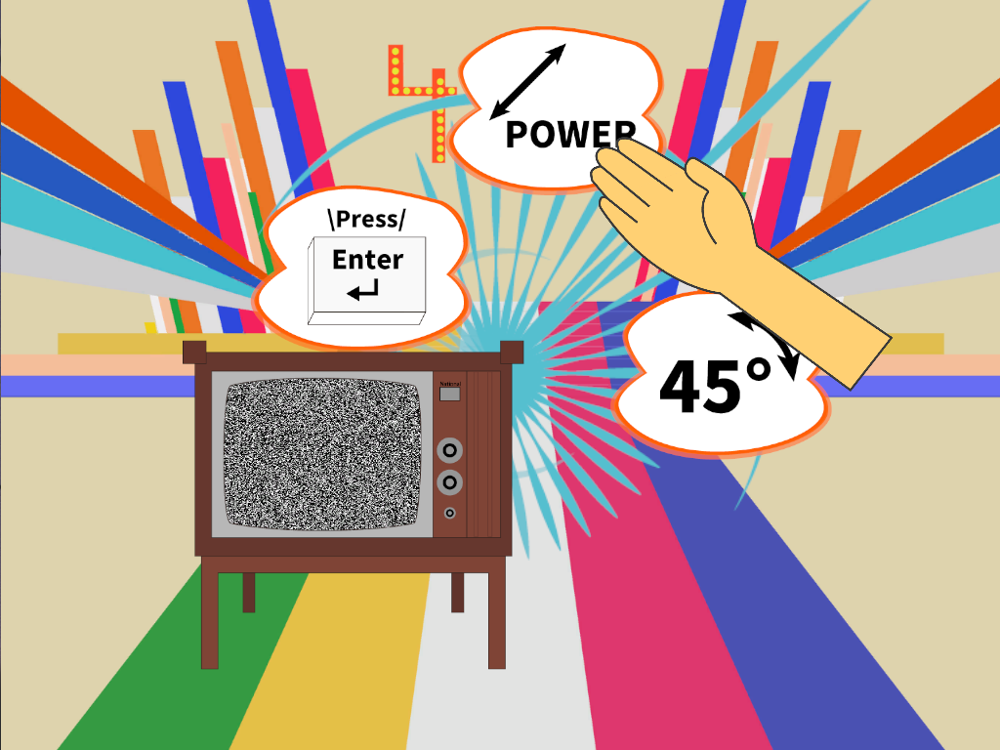
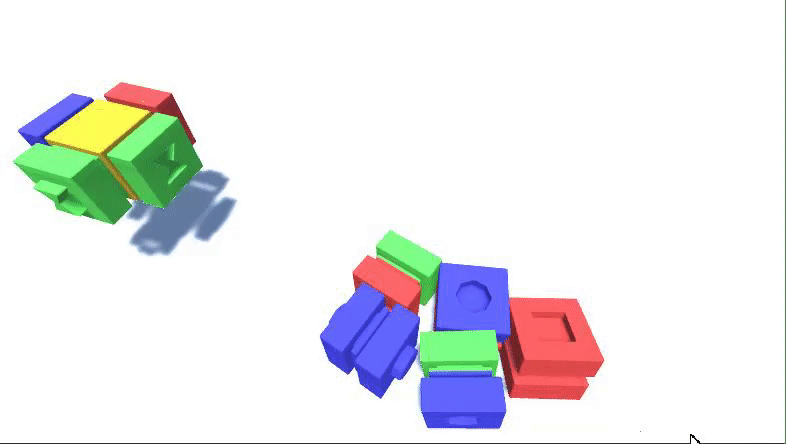
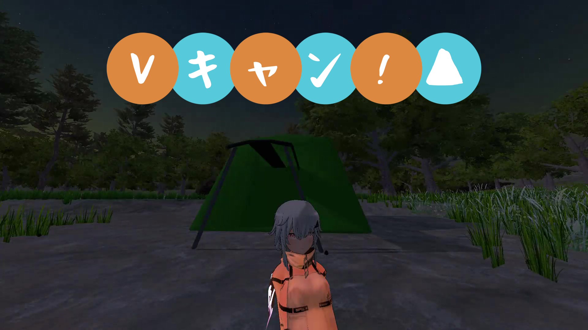
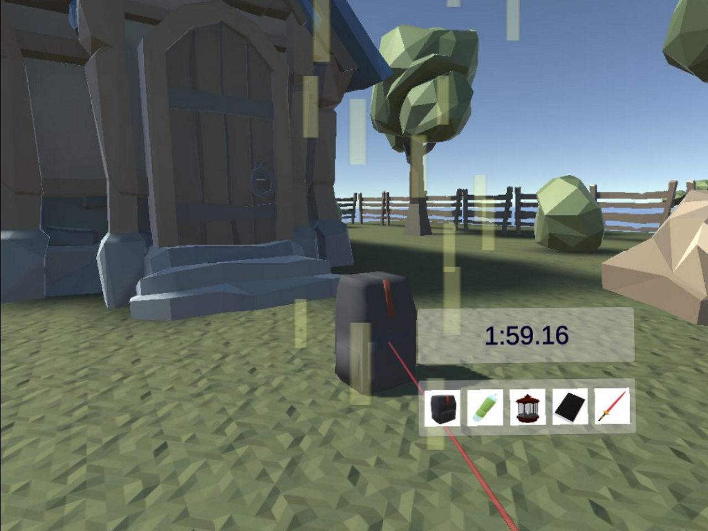
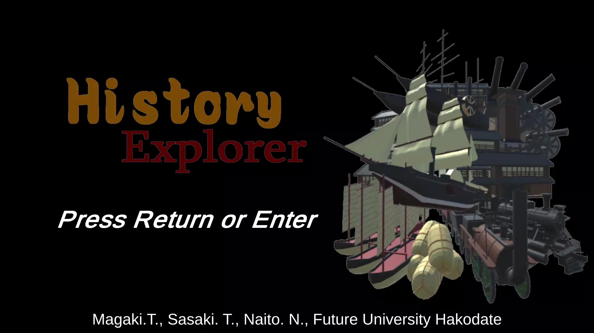
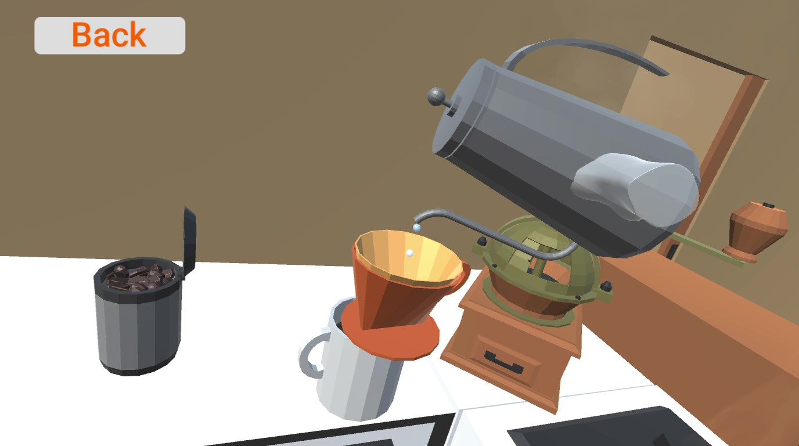

# Portfolio

## About

- Name: Takuro Magaki
- Handle: AconCavy
- Twitter: [@AconCavy](https://twitter.com/AconCavy)
- GitHub: [AconCavy](https://github.com/AconCavy)
- 
- Blog: [acon.log](https://aconcavy.github.io/blog/)
- Interest: VR/AR/xR, Game Development
- Language: Japanese, English

I am good at developing games and simulators mainly using C# and Unity as an IT engineer.
And, as a researcher, I had been researched that forecasting cybersickness (aka Virtual Reality sickness) using physiological data in Virtual Reality in Future University Hakodate, Japan.
I am interested in game developments and realizing new life experiences using xR technology.
Please contact me via a direct message on Twitter if you are interested.

## Contents

- [Education](#education)
- [Qualifications](#qualifications)
- [Skills](#skills)
- [Works](#works)
- [Publications](#publications)

## Education

- Future University Hakodate, Japan, Master of Systems Information Science (2018-2020)
- Future University Hakodate, Japan, Bachelor of Systems Information Science (2014-2018)

## Qualifications

- Applied Information Technology Engineer Examination, Japan (June 2017)
- Fundamental Information Technology Engineer Examination, Japan (Nov. 2016)

## Skills

- Programming Languages: C#, Python 3.x
- Frameworks: Unity, Xamarin.Forms, ASP .NET Core WebApi
- Others: git, GitHub Actions

## Works

### [Mulinq](https://github.com/AconCavy/Mulinq) (2021)

The library is C# LINQ extensions for collections and multidimensional arrays. A package of the library is published on [NuGet](https://www.nuget.org/packages/Mulinq). A unit testing, linting, and release of the package that have been managed by GitHub Actions in the repository of the library.

### [CompetitiveProgrammingTemplateCSharp](https://github.com/AconCavy/CompetitiveProgrammingTemplateCSharp) (2020)

The template is dotnet cli template for competitive programming using C#. The template will provide a tasks and tests projects, a solver class item, and a test class item.
It is blogged [here](https://aconcavy.github.io/Blog/posts/20201129dotnettemplate). (Japanese)

### [SnippetBuilder](https://github.com/AconCavy/SnippetBuilder) (2020)

The application is building editor's snippets files for competitive programming library etc.

### [algorithm-csharp](https://github.com/AconCavy/algorithm-csharp) (2020)

The library is an algorithm library for competitive programming contests. It is based on [ac-library](https://github.com/atcoder/ac-library) written by C#, which some additional classes. 

### [E4Analyzer](https://github.com/AconCavy/E4Analyzer) (2020)

The application is statistical processing csv files obtained from [Empatica E4](https://www.empatica.com/research/e4/). 

### [Forty Five](https://globalgamejam.org/2020/games/ffxlv-1) (2020)

The game named Forty Five that attacks from the 45 degrees to repair things was developed in the Global Game Jam 2020.

### [Cybatica](https://github.com/AconCavy/Cybatica) (2019)

The mobile application named Cybatica was developed using Xamarin.Forms in the master's research. Cybatica connects with the [Empatica E4](https://www.empatica.com/research/e4/) to forecast and monitor cybersickness using physiological data (HRV and EDA) in the realtime.

### [BrickChain](https://unityroom.com/games/brickchain-aconcavy) (2019)

The game named BrickChain that connects a lot of blocks that have + or - joints within a minute, which was developed in the unity 1 week game jam.

### VCamp (2018)

The Vtuber was made in the Vtuber Hackathon 2018 Hokkaido.

[VCamp movie](https://drive.google.com/open?id=1jA2ZNOc9m0dAUo1Q1Ukc_oHKp8Y_AASp)

### Fishing Go (2018)

The game named Fishing Go that fishes on the Oculus Go.

[Fishing Go movie](https://drive.google.com/open?id=14XsZNul2GlLGEDGJbPaYGJQI0fVO8o3z)

### PolyWorld (2018)

The 3D world was developed and used as experimental material in the master's research experiments.

### EV3-RtVLink (2017)

The simulator that synchronizes LEGO EV3 between real and virtual. The system was developed to support my professor's research.

[EV3-RtVLink movie](https://drive.google.com/open?id=14LTneGgyPSW2qsJ2J7Lq6wAEGyYZKG0e)

### History Explorer (2016-2017)

The game that learns Japanese history for elementary school students, which was developed as project-based learning. The Japanese version was tested for local students and published the English version for the international conference.

[History Explorer movie](https://drive.google.com/open?id=1ndhhCcVCscIlTjAnaG2jha8g9-jAjR7U)

### MSN Cooking (2016)

The game that cooks coffee and steaks using LeapMotion, which was developed as a class project.

[MSN Cooking movie](https://drive.google.com/open?id=1wOuyAjP61UEIJ-fQjSdu35zU4yrmcuRM)

### Maze (2016)

The game is the first work to be made by Unity that navigates a ball to the goal using an acceleration sensor and the maze is auto-generated.

[Maze movie](https://drive.google.com/open?id=1HH_vSyQ0sm7LaLvFQvblk19Id4YGv6DP)

## Publications

### Authored

1. Magaki, T. & Vallance, M. (2020). Seeking Accessible Physiological Metrics to Detect Cybersickness in VR, International Journal of Virtual and Augmented Reality (IJVAR) Vol. 4, No. 1, pp. 1-18. doi: 10.4018/IJVAR.2020010101.
1. Magaki, T & Vallance, M. (2019). Real-time Monitoring Method for Cybersickness using Physiological Signals. In Proceedings of VRST '19: 25th ACM Symposium on Virtual Reality Software and Technology (VRST '19), November 12-15, 2019, Parramatta, NSW, Australia. ACM, New York, NY, USA, 2 pages. [https://doi.org/10.1145/3359996.3364700](https://doi.org/10.1145/3359996.3364700)
1. Magaki, T. & Vallance, M. (2019). Real-time Forecasting of Cybersickness. The 24th Annual Conference of the Virtual Reality Society of Japan. The University of Tokyo, 11 - 13 Sept., 2019. Paper 4C-02 available at [http://conference.vrsj.org/ac2019/program/index-e.html](http://conference.vrsj.org/ac2019/program/index-e.html)
1. Magaki, T. & Vallance, M. (2019). Developing an accessible evaluation method of VR cybersickness. Conference on Virtual Reality and 3D User Interfaces, IEEE VR 2019 Posters, March 23-27, Osaka, Japan. Available online.
1. Magaki, T. & Vallance, M. (2018). Measuring Reduction Methods for VR Sickness in Virtual Environments. International Journal of Virtual and Personal Learning Environments (IJVPLE), Vol. 7 (2). pp. 27-43. doi: 10.4018/IJVPLE.2017070103 Available online.

### Co-Authored

1. Vallance, M., Magaki, T. & Kurashige, Y. (2020). Determining the Efficacy of Virtual Reality through Experientiality and Biometrics, 6th International Conference of the Immersive Learning Research Network (iLRN 2020) Online, June 21-25, 2020. pp. 344 - 347. ISBN 978-1-7348995.
1. Vallance, M. Magaki, T. Kurashige, Y & Johnson, L. (2019). SolarVR for inter-cognitive and intra-cognitive communication. In Proceedings of VRST '19: 25th ACM Symposium on Virtual Reality Software and Technology (VRST '19), November 12-15, 2019, Parramatta, NSW, Australia. ACM, New York, NY, USA, 2 pages. [https://doi.org/10.1145/3359996.3364702](https://doi.org/10.1145/3359996.3364702)
1. Vallance, M., Kurashige, Y. & Magaki, T. (2019). Creative learning in VR: an antidisciplinary approach. Conference on Virtual Reality and 3D User Interfaces, IEEE VR 2019 Videos, March 23-27, Osaka, Japan. Available online.
1. Vallance, M., Kurashige, Y. & Magaki, T. (2018). Fukushima Nuclear Plant as a Synthetic Learning Environment. SIGGRAPH Asia, SA '18 Posters, December 04-07, 2018, Tokyo, Japan ACM 978-1-4503-6063-0/18/12. doi: 10.1145/3283289.3283292. Available online.
1. Vallance, M., Magaki, T. & Sasaki, T. (2018). Inter-cognitive communication for immersive virtual education: four robot solutions. In Proceedings of EdMedia: World Conference on Educational Media and Technology (pp. 1591-1597). Amsterdam, Netherlands: Association for the Advancement of Computing in Education (AACE). Retrieved July 12, 2018 from [https://academicexperts.org/conf/edmedia/2018/papers/53178/](https://academicexperts.org/conf/edmedia/2018/papers/53178/)
1. Vallance, M., Kurashige, Y., Sasaki, T. & Magaki, T. (2017). Development of a Synthetic Learning Environment in the Antidisciplinary Space. In Proceedings of The 11th European Conference on Game-Based Learning ECGBL 2017, The FH JOANNEUM University of Applied Science, Graz, Austria, 4 - 6 October, 2017. pp. 705 - 714.  ISBN: 978-1-911218-57-9
1. Sasaki, T., Vallance, M., Magaki, T., Naito, N., Sumi, K., Bagenda Kasujja, D. and Tsubakimoto, M. (2017).  Japanese History Explorer With Nozomi-chan for Elementary School Children. In Proceedings of The 11th European Conference on Game-Based Learning ECGBL 2017, The FH JOANNEUM University of Applied Science, Graz, Austria, 4 - 6 October, 2017. pp. 562 - 570. ISBN: 978-1-911218-57-9
1. Vallance, M., Kurashige, Y., Sasaki, T. & Magaki, T. (2017). Who needs experts? Students designing a Synthetic Learning Environment of the Fukushima nuclear power plant. In J. Johnston (Ed.), Proceedings of EdMedia 2017 (pp. 1223-1228). Washington, DC: Association for the Advancement of Computing in Education (AACE). Retrieved August 16, 2017 from [https://www.learntechlib.org/p/178440/](https://www.learntechlib.org/p/178440/)
